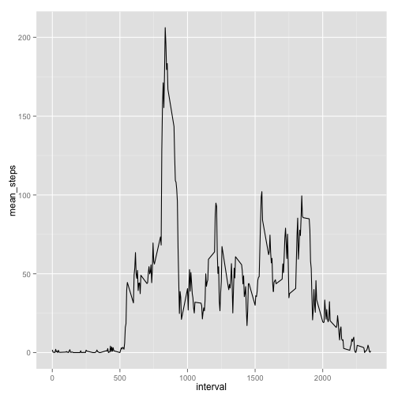
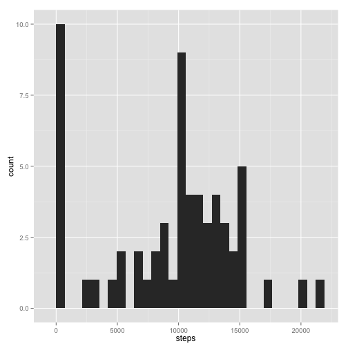
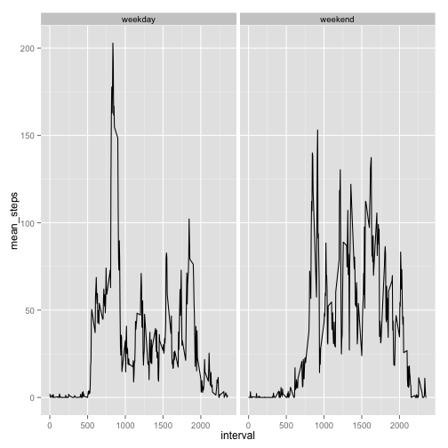

# Settings

```r
echo=TRUE
```

## Loading and preprocessing the data

Read data into R

```r
data <- read.csv('data/activity.csv', stringsAsFactors = FALSE)
names(data)
```

```
## [1] "steps"    "date"     "interval"
```

```r
dim(data)
```

```
## [1] 17568     3
```

## What is mean total number of steps taken per day?

Calculate the total number of steps taken per day 


```r
library(dplyr, quietly = TRUE)
# Remove na values and group by data
data.total <- group_by(data, date) %>% summarise(steps = sum(steps, na.rm = TRUE), interval = sum(interval, na.rm = TRUE))
```

If you do not understand the difference between a histogram and a barplot, research the difference between them. Make a histogram of the total number of steps taken each day.


```r
library(ggplot2, quietly = TRUE)
ggplot(data.total, aes(steps)) + geom_histogram()
```

```
## stat_bin: binwidth defaulted to range/30. Use 'binwidth = x' to adjust this.
```

 

Calculate and report the mean and median of the total number of steps taken per day


```r
# Mean of data
mean(data.total$steps)
```

```
## [1] 9354.23
```

```r
# Median of data
median(data.total$steps)
```

```
## [1] 10395
```


## What is the average daily activity pattern?

Make a time series plot (i.e. type = "l") of the 5-minute interval (x-axis) and the average number of steps taken, averaged across all days (y-axis)


```r
mean.daily <- group_by(data, interval) %>% summarise(mean_steps = mean(steps, na.rm = TRUE))
ggplot(mean.daily, aes(interval, mean_steps)) + geom_line()
```

 

Which 5-minute interval, on average across all the days in the dataset, contains the maximum number of steps?


```r
mean.daily[mean.daily$mean_steps == max(mean.daily$mean_steps),]
```

```
## Source: local data frame [1 x 2]
## 
##   interval mean_steps
## 1      835   206.1698
```

## Imputing missing values

Calculate and report the total number of missing values in the dataset (i.e. the total number of rows with NAs)


```r
sum(is.na(data))
```

```
## [1] 2304
```

Devise a strategy for filling in all of the missing values in the dataset. The strategy does not need to be sophisticated. For example, you could use the mean/median for that day, or the mean for that 5-minute interval, etc.

Create a new dataset that is equal to the original dataset but with the missing data filled in.


```r
data.new <- data
data.new[is.na(data.new$steps),]$steps <- median(data.new$steps, na.rm = TRUE)
sum(is.na(data.new))
```

```
## [1] 0
```

Make a histogram of the total number of steps taken each day and Calculate and report the mean and median total number of steps taken per day.


```r
data.new.total <- group_by(data.new, date) %>% summarise(steps = sum(steps, na.rm = TRUE), interval = sum(interval, na.rm = TRUE))
ggplot(data.new.total, aes(steps)) + geom_histogram()
```

```
## stat_bin: binwidth defaulted to range/30. Use 'binwidth = x' to adjust this.
```

 

Do these values differ from the estimates from the first part of the assignment? What is the impact of imputing missing data on the estimates of the total daily number of steps?


```r
# Mean of data
mean(data.new.total$steps)
```

```
## [1] 9354.23
```

```r
# Median of data
median(data.new.total$steps)
```

```
## [1] 10395
```

## Are there differences in activity patterns between weekdays and weekends?

For this part the weekdays() function may be of some help here. Use the dataset with the filled-in missing values for this part.

Create a new factor variable in the dataset with two levels – “weekday” and “weekend” indicating whether a given date is a weekday or weekend day.


```r
library(lubridate)
data.final <- mutate(data.new, day = weekdays(parse_date_time(data.new$date, "%Y-%m-%d") ))
data.final$day <- as.factor(data.final$day)
# Check levels
levels(data.final$day)
```

```
## [1] "Friday"    "Monday"    "Saturday"  "Sunday"    "Thursday"  "Tuesday"  
## [7] "Wednesday"
```

```r
# Change levels to weekday and weekends
levels(data.final$day) <- list(weekday = c("Monday", "Tuesday",
                                             "Wednesday", 
                                             "Thursday", "Friday"),
                                 weekend = c("Saturday", "Sunday"))
# Confirm variable change
levels(data.final$day)
```

```
## [1] "weekday" "weekend"
```

Make a panel plot containing a time series plot (i.e. type = "l") of the 5-minute interval (x-axis) and the average number of steps taken, averaged across all weekday days or weekend days (y-axis). 


```r
data.final <- group_by(data.final, interval, day) %>% summarise(mean_steps = mean(steps))
# Plot data
ggplot(data.final, aes(interval, mean_steps)) + geom_line() + facet_grid(. ~ day)
```

 
